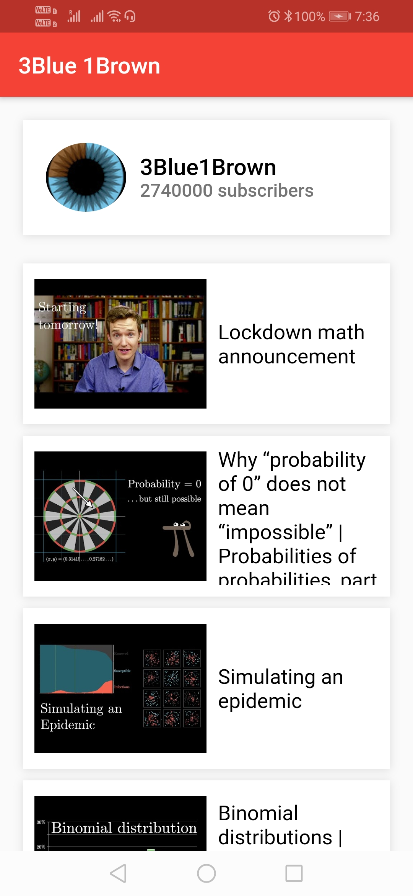

# youtube_app

A new Flutter application.

## Getting Started

A basic app to view all YouTube videos of a particular channel. I have used Google YouTube-v3 API for making this app.

 

Technology Stack -

=> Dart
